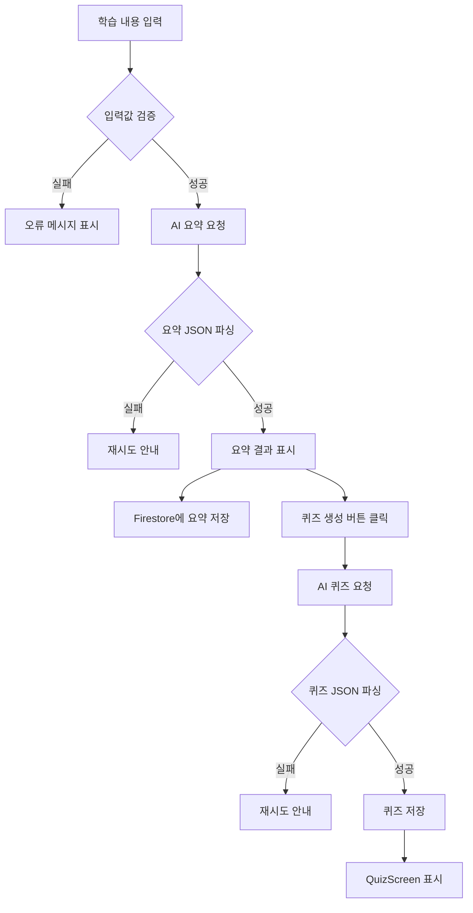

# AI 기능 흐름 설계서

## 1. 문서 목적

이 문서는 StudyMate의 AI 요약 생성과 AI 퀴즈 생성 흐름을 정의하여 AIService 구현의 기준으로 사용한다.

## 2. 핵심 내용

AI 기능은 두 단계로 구성된다.

1. 학습 내용 기반 요약 생성
2. 요약 또는 원문 기반 객관식 퀴즈 생성

## 3. 상세 설명

### 요약 생성 흐름

1. 사용자가 제목, 과목명, 학습 내용을 입력한다.
2. 앱이 제목과 학습 내용 길이를 검증한다.
3. 학습 내용이 30자 미만이면 AI 요청을 보내지 않는다.
4. AIService가 요약 프롬프트를 구성한다.
5. AI API에 요청을 보낸다.
6. 응답 JSON에서 summary와 keywords를 추출한다.
7. SummaryResultScreen에 결과를 표시한다.
8. Firestore의 study_notes 컬렉션에 저장한다.

### 퀴즈 생성 흐름

1. 사용자가 SummaryResultScreen에서 퀴즈 생성 버튼을 누른다.
2. AIService가 요약 또는 원문을 기반으로 퀴즈 생성 프롬프트를 구성한다.
3. AI API에 객관식 문제 3개 생성을 요청한다.
4. 응답 JSON 배열을 파싱한다.
5. 각 문제를 QuizModel로 변환한다.
6. Firestore의 quizzes 컬렉션에 저장한다.
7. QuizScreen으로 이동한다.

### AI 응답 검증 기준

| 응답 | 필수 필드 | 검증 조건 |
| --- | --- | --- |
| 요약 | summary, keywords | summary는 3개 이상, keywords는 3개 권장 |
| 퀴즈 | question, options, answerIndex, explanation | options는 4개, answerIndex는 0~3 |

## 4. 개발 시 참고사항

- AI 응답은 항상 정상 JSON이라고 가정하지 않는다.
- JSON 파싱 실패 시 원본 응답을 로그로 남기고 사용자에게는 간단한 오류 메시지만 보여준다.
- API 응답 시간이 길 수 있으므로 로딩 상태를 반드시 제공한다.
- 퀴즈 생성 입력은 요약을 기본으로 하되, 내용이 부족하면 원문을 함께 사용하는 방식을 고려한다.
- API 비용 관리를 위해 MVP에서는 문제 수를 3개로 제한한다.

## 5. 확인 체크리스트

- [ ] 요약 생성 전 입력값 검증이 포함되어 있는가?
- [ ] 요약 응답 JSON 구조가 정의되어 있는가?
- [ ] 퀴즈 응답 JSON 구조가 정의되어 있는가?
- [ ] 파싱 실패와 API 실패 처리가 고려되어 있는가?
- [ ] Firestore 저장 시점이 흐름에 포함되어 있는가?
