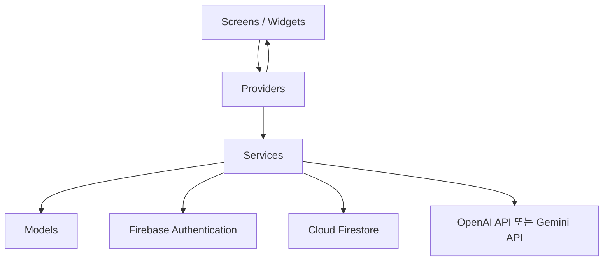

# 앱 아키텍처 설계서

## 1. 문서 목적

이 문서는 StudyMate Flutter 앱의 폴더 구조, 계층별 책임, Firebase 및 AI API 연동 방식을 정의한다.

## 2. 핵심 내용

StudyMate는 화면, 상태 관리, 서비스, 모델을 분리한 구조를 사용한다.

## 3. 상세 설명

### 계층별 책임

| 계층 | 폴더 | 책임 |
| --- | --- | --- |
| App Entry | `main.dart`, `app.dart` | 앱 초기화, Firebase 초기화, 테마 및 라우팅 설정 |
| Models | `models/` | Firestore 문서와 앱 내부 데이터 객체 정의 |
| Screens | `screens/` | 화면 UI와 사용자 입력 처리 |
| Services | `services/` | Firebase, AI API, 퀴즈 계산 등 비즈니스 로직 처리 |
| Providers | `providers/` | 인증, 학습, 퀴즈 상태 관리 |
| Widgets | `widgets/` | 재사용 가능한 UI 컴포넌트 |
| Utils | `utils/` | 상수, 입력 검증, 공통 유틸리티 |

### 주요 서비스 구성

| 서비스 | 역할 |
| --- | --- |
| AuthService | 회원가입, 로그인, 로그아웃, 현재 사용자 확인 |
| FirestoreService | 학습 기록, 퀴즈, 결과, 오답 데이터 저장 및 조회 |
| AIService | AI 요약 요청, AI 퀴즈 생성 요청, JSON 파싱 |
| QuizService | 답안 확인, 점수 계산, 오답 추출 |

### 데이터 흐름 예시

1. 사용자가 StudyInputScreen에서 학습 내용을 입력한다.
2. StudyProvider가 입력값 검증 후 AIService를 호출한다.
3. AIService가 AI API에 요약 요청을 보낸다.
4. 응답 JSON을 파싱해 StudyNoteModel 형태로 정리한다.
5. FirestoreService가 study_notes 컬렉션에 저장한다.
6. Provider가 화면 상태를 갱신한다.

## 4. 개발 시 참고사항

- 화면에서 Firebase SDK를 직접 호출하지 말고 Service 계층을 통해 호출한다.
- Provider는 화면 상태와 서비스 호출 결과를 연결하는 역할로 제한한다.
- Firestore 컬렉션명과 모델 필드명은 문서화된 스키마를 기준으로 통일한다.
- AI API Key는 클라이언트 코드에 직접 포함하지 않는 구조를 권장한다.
- MVP에서는 개발 편의상 임시 키 관리가 가능하지만, 보안 리스크를 명확히 표시해야 한다.

## 5. 확인 체크리스트

- [ ] 화면, 서비스, 모델, 상태 관리 책임이 분리되어 있는가?
- [ ] Firebase 호출이 서비스 계층으로 모여 있는가?
- [ ] AI API 호출과 JSON 파싱 책임이 AIService에 있는가?
- [ ] QuizService가 점수 계산과 오답 추출을 담당하는가?
- [ ] 폴더 구조 문서와 일치하는가?
