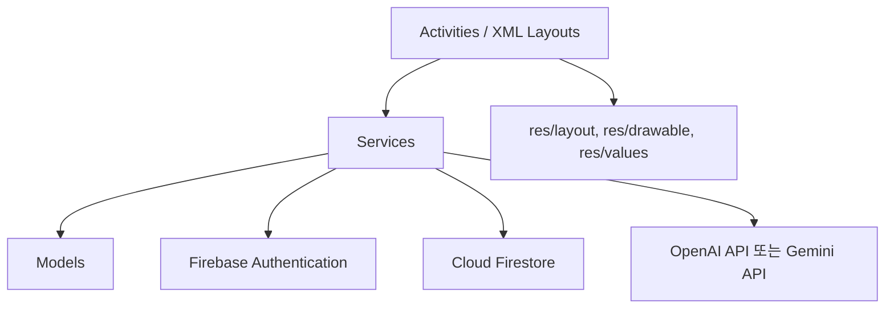

# 앱 아키텍처 설계서

## 1. 문서 목적

이 문서는 StudyMate Android Java 앱의 폴더 구조, 계층별 책임, Firebase 및 AI API 연동 방식을 정의한다.

## 2. 핵심 내용

StudyMate는 Activity, 서비스, 모델, 리소스를 분리한 구조를 사용한다.

## 3. 상세 설명

### 계층별 책임

| 계층 | 위치 | 책임 |
| --- | --- | --- |
| App Entry | `AndroidManifest.xml`, `SplashActivity.java` | 앱 시작, 로그인 상태 확인, 초기 화면 분기 |
| Activities | `java/com/example/studymate/*Activity.java` | 화면 UI 연결, 사용자 입력 처리, 화면 이동 |
| Models | `java/com/example/studymate/model/` | Firestore 문서와 앱 내부 데이터 객체 정의 |
| Services | `java/com/example/studymate/service/` | Firebase, AI API, 퀴즈 계산 등 비즈니스 로직 처리 |
| Utils | `java/com/example/studymate/util/` | 상수, 입력 검증, 공통 유틸리티 |
| Layout Resources | `res/layout/` | Activity별 화면 XML |
| Drawable Resources | `res/drawable/` | 버튼, 카드, 입력 필드, 선택 상태 배경 |
| Values Resources | `res/values/` | 색상, 문자열, 치수, 테마 |

### 주요 서비스 구성

| 서비스 | 역할 |
| --- | --- |
| AuthService | 회원가입, 로그인, 로그아웃, 현재 사용자 확인 |
| FirestoreService | 학습 기록, 퀴즈, 결과, 오답 데이터 저장 및 조회 |
| AiService | AI 요약 요청, AI 퀴즈 생성 요청, JSON 파싱 |
| QuizService | 답안 확인, 점수 계산, 오답 추출 |

### 데이터 흐름 예시

1. 사용자가 StudyInputActivity에서 학습 내용을 입력한다.
2. Activity가 입력값을 검증하고 AiService를 호출한다.
3. AiService가 AI API에 요약 요청을 보낸다.
4. 응답 JSON을 파싱해 StudyNoteModel 형태로 정리한다.
5. FirestoreService가 study_notes 컬렉션에 저장한다.
6. Activity가 SummaryResultActivity로 이동하거나 오류 상태를 표시한다.

## 4. 현재 구현 상태

현재 Android Java 프로젝트에는 우지훈 담당 화면 흐름 골격이 구현되어 있다.

| 화면 | 파일 | 상태 |
| --- | --- | --- |
| SplashScreen | `SplashActivity.java`, `activity_splash.xml` | 더미 로그인 상태 분기 구현 |
| LoginScreen | `LoginActivity.java`, `activity_login.xml` | 더미 로그인 구현 |
| SignUpScreen | `SignUpActivity.java`, `activity_signup.xml` | 입력 검증 및 더미 가입 구현 |
| HomeScreen | `HomeActivity.java`, `activity_home.xml` | 더미 통계/최근 기록/하단 탭 구현 |
| StudyInputScreen | `StudyInputActivity.java`, `activity_study_input.xml` | 입력 검증 및 더미 AI 로딩 구현 |
| SummaryResultScreen | `SummaryResultActivity.java`, `activity_summary_result.xml` | 더미 요약/키워드 표시 구현 |
| QuizScreen | `QuizActivity.java`, `activity_quiz.xml` | 더미 3문제 풀이 구현 |
| QuizResultScreen | `QuizResultActivity.java`, `activity_quiz_result.xml` | 정답률 표시 구현 |
| WrongAnswerScreen | `WrongAnswerActivity.java`, `activity_wrong_answer.xml` | 더미 오답 상세 구현 |
| MyPageScreen | `MyPageActivity.java`, `activity_my_page.xml` | 더미 통계 및 로그아웃 구현 |

## 5. 개발 시 참고사항

- 화면에서 Firebase SDK를 직접 호출하지 말고 Service 계층을 통해 호출한다.
- Activity는 화면 이벤트와 상태 표시를 담당하고, 데이터 저장/조회는 Service로 분리한다.
- Firestore 컬렉션명과 모델 필드명은 문서화된 스키마를 기준으로 통일한다.
- AI API Key는 Android 클라이언트 코드에 직접 포함하지 않는 구조를 권장한다.
- MVP에서는 개발 편의상 임시 키 관리가 가능하지만, 보안 리스크를 명확히 표시해야 한다.

## 6. 확인 체크리스트

- [ ] Activity, Service, Model, Resource 책임이 분리되어 있는가?
- [ ] Firebase 호출이 서비스 계층으로 모여 있는가?
- [ ] AI API 호출과 JSON 파싱 책임이 AiService에 있는가?
- [ ] QuizService가 점수 계산과 오답 추출을 담당하는가?
- [ ] 폴더 구조 문서와 일치하는가?
