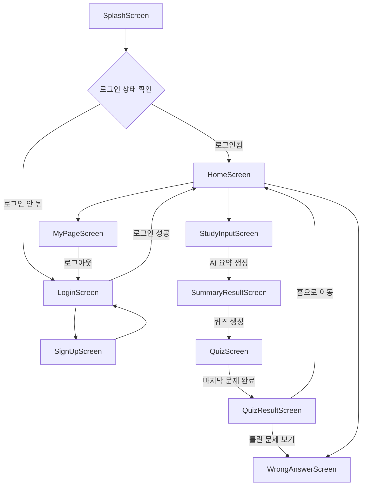

# 화면 흐름 설계서

## 1. 문서 목적

이 문서는 StudyMate 앱의 전체 화면 이동 흐름을 정의하여 화면 구현과 라우팅 설계의 기준으로 사용한다.

## 2. 핵심 내용

전체 화면 흐름은 다음과 같다.

```text
SplashScreen
↓
LoginScreen / SignUpScreen
↓
HomeScreen
├─ StudyInputScreen
├─ SummaryResultScreen
├─ QuizScreen
├─ QuizResultScreen
├─ WrongAnswerScreen
└─ MyPageScreen
```

## 3. 상세 설명



### 주요 화면 전환 규칙

| 출발 화면 | 도착 화면 | 조건 |
| --- | --- | --- |
| SplashScreen | HomeScreen | 로그인 상태가 유지된 경우 |
| SplashScreen | LoginScreen | 로그인 상태가 없는 경우 |
| LoginScreen | HomeScreen | 로그인 성공 |
| LoginScreen | SignUpScreen | 회원가입 이동 버튼 클릭 |
| HomeScreen | StudyInputScreen | 오늘의 학습 시작 버튼 클릭 |
| StudyInputScreen | SummaryResultScreen | AI 요약 생성 성공 |
| SummaryResultScreen | QuizScreen | 퀴즈 생성 성공 |
| QuizScreen | QuizResultScreen | 마지막 문제 풀이 완료 |
| QuizResultScreen | WrongAnswerScreen | 틀린 문제 보기 클릭 |
| HomeScreen | WrongAnswerScreen | 오답노트 바로가기 클릭 |
| HomeScreen | MyPageScreen | 마이페이지 이동 |

### 예외 흐름

- 로그인 실패 시 LoginScreen에 머무르며 오류 메시지를 표시한다.
- 요약 생성 실패 시 StudyInputScreen 또는 SummaryResultScreen 진입 전 상태에서 오류 메시지를 표시한다.
- 퀴즈 생성 실패 시 SummaryResultScreen에 머무르며 재시도 버튼을 제공한다.
- 퀴즈 중간 이탈 시 현재 MVP에서는 풀이 상태를 저장하지 않는다.

## 4. 개발 시 참고사항

- Android 라우팅은 `Activity`와 `Intent`를 기준으로 일관되게 관리한다.
- 인증 상태 확인은 SplashScreen에서 처리한다.
- AI 요청 화면에서는 중복 클릭 방지를 위해 버튼 비활성화 또는 로딩 상태를 적용한다.
- 결과 저장 후 화면 이동이 이루어져야 데이터 누락을 줄일 수 있다.

## 5. 확인 체크리스트

- [ ] 로그인 여부에 따른 초기 분기가 정의되어 있는가?
- [ ] 학습 입력부터 오답노트까지 핵심 흐름이 연결되어 있는가?
- [ ] 예외 흐름이 최소한으로 정의되어 있는가?
- [ ] 홈 화면에서 주요 화면으로 이동 가능한가?
- [ ] 로그아웃 후 로그인 화면으로 돌아가는가?
