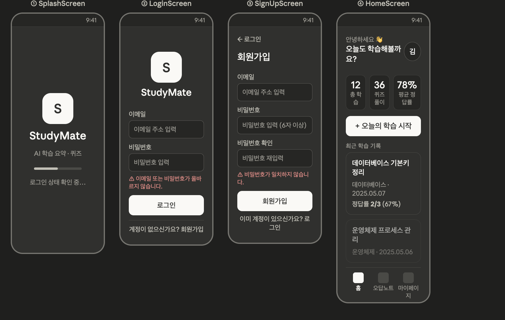
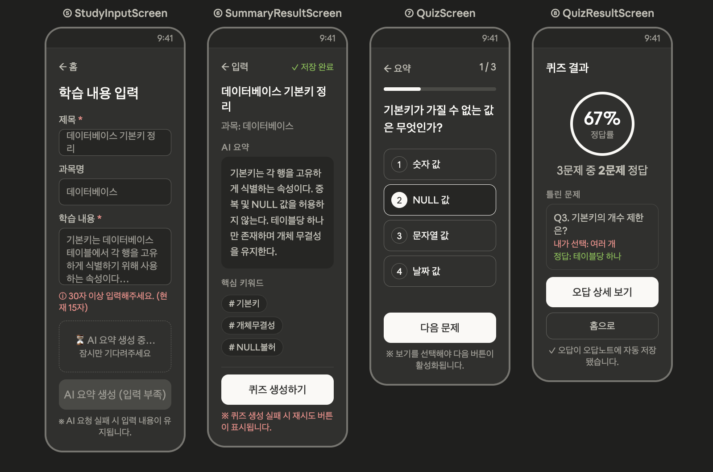
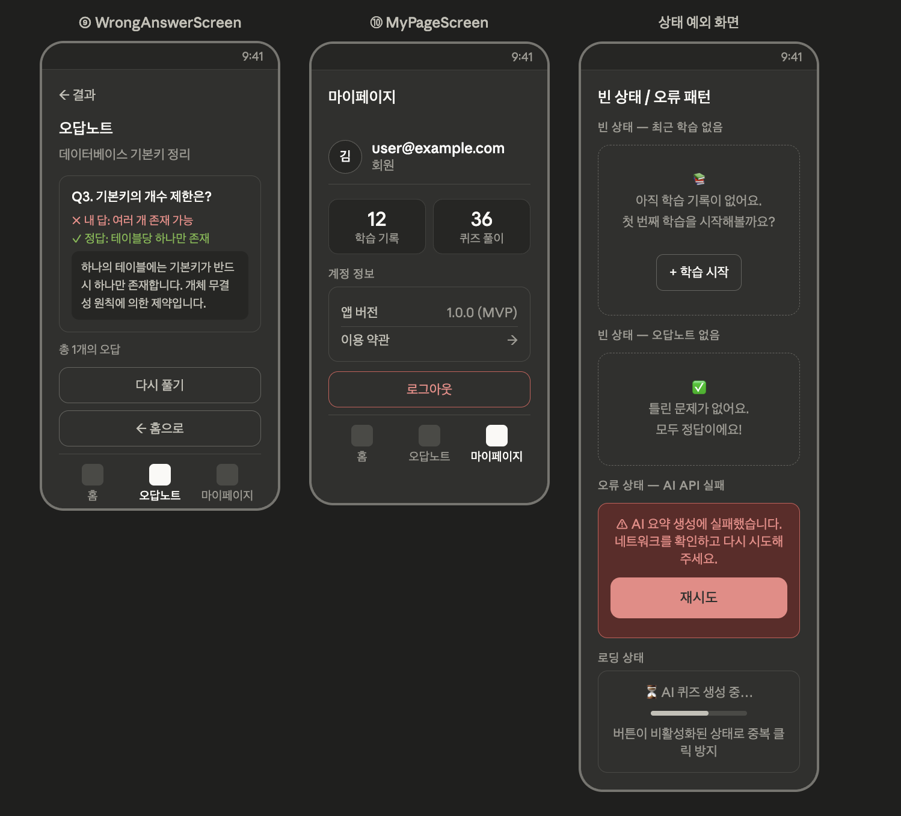

# 와이어프레임 문서

## 1. 문서 목적

이 문서는 StudyMate 모바일 앱의 MVP 화면 와이어프레임을 정리한 문서이다. 기존 화면 설계서와 와이어프레임 이미지를 기준으로 각 화면의 UI 구성, 주요 동작, 상태 표현을 개발 단계에서 참고할 수 있도록 정리한다.

## 2. 와이어프레임 이미지 파일

와이어프레임 이미지는 `docs/03_design/assets/` 경로에 저장한다. 각 이미지는 해당 화면 설명이 시작되는 위치에 삽입한다.

| 파일명 | 삽입 위치 |
| --- | --- |
| `wireframe_01_auth_home.png` | SplashScreen, LoginScreen, SignUpScreen, HomeScreen 설명 앞 |
| `wireframe_02_study_quiz.png` | StudyInputScreen, SummaryResultScreen, QuizScreen, QuizResultScreen 설명 앞 |
| `wireframe_03_wrong_mypage_states.png` | WrongAnswerScreen, MyPageScreen, 상태 및 예외 화면 설명 앞 |

## 3. 핵심 화면 흐름

```text
SplashScreen
↓
LoginScreen / SignUpScreen
↓
HomeScreen
↓
StudyInputScreen
↓
SummaryResultScreen
↓
QuizScreen
↓
QuizResultScreen
↓
WrongAnswerScreen
```

하단 탭은 `홈`, `오답노트`, `마이페이지` 3개로 구성한다. 학습 생성 흐름은 하단 탭이 아니라 홈 화면의 `오늘의 학습 시작` 버튼에서 시작한다.

## 4. 디자인 방향

| 항목 | 방향 |
| --- | --- |
| 플랫폼 | 모바일 앱, 세로 화면 기준 |
| 스타일 | 다크 테마 기반의 저채도 UI |
| 주요 색상 | 어두운 배경, 흰색 주요 버튼, 빨간색 오류, 초록색 성공 상태 |
| 정보 구조 | 학습 시작, AI 결과 확인, 퀴즈 풀이가 빠르게 이어지는 단순 구조 |
| 내비게이션 | 상단 뒤로가기, 하단 탭, 주요 CTA 버튼 중심 |
| 상태 표현 | 로딩, 오류, 빈 상태를 별도 카드 또는 안내 영역으로 표시 |

## 5. 화면별 와이어프레임 상세



### 5.1 SplashScreen

| 구분 | 내용 |
| --- | --- |
| 목적 | 앱 실행 후 로그인 상태를 확인한다. |
| 주요 요소 | StudyMate 로고, 서비스명, 보조 문구, 진행 바, 로그인 상태 확인 문구 |
| 다음 이동 | 로그인 상태가 있으면 HomeScreen, 없으면 LoginScreen |

화면 중앙에 앱 로고와 서비스명을 배치한다. 하단에는 짧은 진행 바와 `로그인 상태 확인 중...` 문구를 표시해 사용자가 대기 상태를 인지할 수 있게 한다.

### 5.2 LoginScreen

| 구분 | 내용 |
| --- | --- |
| 목적 | 이메일과 비밀번호로 로그인한다. |
| 주요 요소 | 로고, StudyMate 타이틀, 이메일 입력, 비밀번호 입력, 로그인 버튼, 회원가입 이동 링크 |
| 오류 상태 | 이메일 또는 비밀번호가 올바르지 않을 경우 빨간색 오류 메시지 표시 |
| 다음 이동 | 로그인 성공 시 HomeScreen, 회원가입 클릭 시 SignUpScreen |

입력 필드는 세로로 배치하고, 로그인 버튼은 화면 하단 주요 CTA로 둔다. 로그인 실패 메시지는 버튼 위에 표시한다.

### 5.3 SignUpScreen

| 구분 | 내용 |
| --- | --- |
| 목적 | 새 사용자가 이메일 계정을 생성한다. |
| 주요 요소 | 뒤로가기, 회원가입 제목, 이메일 입력, 비밀번호 입력, 비밀번호 확인 입력, 회원가입 버튼, 로그인 이동 링크 |
| 오류 상태 | 비밀번호 불일치 또는 형식 오류를 입력 필드 아래에 표시 |
| 다음 이동 | 회원가입 성공 시 LoginScreen 또는 HomeScreen |

상단에는 `로그인`으로 돌아가는 뒤로가기 동선을 제공한다. 비밀번호 확인 오류는 회원가입 버튼 위에 표시해 사용자가 버튼을 누르기 전에 문제를 인지할 수 있게 한다.

### 5.4 HomeScreen

| 구분 | 내용 |
| --- | --- |
| 목적 | 학습 시작, 최근 기록 확인, 오답노트 및 마이페이지 진입을 제공한다. |
| 주요 요소 | 인사말, 사용자 아바타, 학습 통계, 오늘의 학습 시작 버튼, 최근 학습 기록 목록, 하단 탭 |
| 주요 CTA | `+ 오늘의 학습 시작` |
| 다음 이동 | StudyInputScreen, WrongAnswerScreen, MyPageScreen |

홈 화면 상단에는 사용자의 학습 상태를 요약한다. 통계는 `총 학습`, `퀴즈 풀이`, `평균 정답률` 3개 카드로 구성한다. 최근 학습 기록 카드에는 제목, 과목명, 날짜, 정답률을 표시한다.



### 5.5 StudyInputScreen

| 구분 | 내용 |
| --- | --- |
| 목적 | AI 요약 생성을 위한 학습 내용을 입력한다. |
| 주요 요소 | 뒤로가기, 제목 입력, 과목명 입력, 학습 내용 입력, 입력 검증 안내, AI 요약 생성 버튼 |
| 입력 조건 | 제목 필수, 학습 내용 30자 이상 |
| 상태 표현 | 입력 부족, AI 요약 생성 중, 요청 실패 후 입력 보존 |
| 다음 이동 | AI 요약 생성 성공 시 SummaryResultScreen |

학습 내용 입력 영역은 긴 텍스트를 붙여넣을 수 있도록 크게 구성한다. 학습 내용이 30자 미만이면 경고 문구를 표시하고 `AI 요약 생성` 버튼은 비활성화한다. AI 요청 중에는 로딩 박스를 표시하고 중복 클릭을 막는다.

### 5.6 SummaryResultScreen

| 구분 | 내용 |
| --- | --- |
| 목적 | AI 요약 결과와 핵심 키워드를 확인하고 퀴즈 생성을 시작한다. |
| 주요 요소 | 뒤로가기, 저장 완료 상태, 학습 제목, 과목명, AI 요약 카드, 핵심 키워드 태그, 퀴즈 생성 버튼 |
| 상태 표현 | 저장 완료, 퀴즈 생성 실패 메시지, 재시도 버튼 |
| 다음 이동 | 퀴즈 생성 성공 시 QuizScreen |

요약 결과는 카드 형태로 표시하고, 키워드는 태그 형태로 나열한다. 상단에는 `저장 완료` 상태를 표시해 Firestore 저장 완료 여부를 알린다. 퀴즈 생성 실패 시 하단에 빨간색 오류 메시지와 재시도 동선을 제공한다.

### 5.7 QuizScreen

| 구분 | 내용 |
| --- | --- |
| 목적 | 객관식 퀴즈를 순서대로 푼다. |
| 주요 요소 | 뒤로가기, 현재 문제 번호, 진행 바, 문제, 보기 4개, 다음 문제 버튼 |
| 입력 조건 | 보기 선택 전에는 다음 버튼 비활성화 |
| 다음 이동 | 마지막 문제 완료 시 QuizResultScreen |

상단에 `1/3` 형식의 문제 진행 상태와 진행 바를 표시한다. 보기 항목은 번호와 텍스트를 함께 표시하고, 선택된 보기는 흰색 테두리와 강조 상태로 구분한다.

### 5.8 QuizResultScreen

| 구분 | 내용 |
| --- | --- |
| 목적 | 퀴즈 풀이 결과와 오답 저장 결과를 확인한다. |
| 주요 요소 | 정답률 원형 표시, 맞힌 문제 수, 틀린 문제 요약, 오답 상세 보기 버튼, 홈으로 버튼, 자동 저장 안내 |
| 주요 CTA | `오답 상세 보기` |
| 다음 이동 | WrongAnswerScreen 또는 HomeScreen |

정답률은 화면 중앙에 크게 표시한다. 틀린 문제가 있는 경우 문제 번호, 내 선택, 정답을 요약 카드로 보여준다. 하단에는 오답이 오답노트에 자동 저장되었음을 안내한다.



### 5.9 WrongAnswerScreen

| 구분 | 내용 |
| --- | --- |
| 목적 | 틀린 문제를 다시 확인하고 복습한다. |
| 주요 요소 | 뒤로가기, 오답노트 제목, 학습 제목, 오답 카드, 내 답, 정답, 해설, 다시 풀기 버튼, 홈으로 버튼, 하단 탭 |
| 빈 상태 | 틀린 문제가 없을 경우 별도 빈 상태 화면 표시 |
| 다음 이동 | 다시 풀기 또는 HomeScreen |

오답 카드에는 문제, 사용자가 선택한 답, 정답, 해설을 함께 표시한다. 내 답은 빨간색, 정답은 초록색으로 구분한다.

### 5.10 MyPageScreen

| 구분 | 내용 |
| --- | --- |
| 목적 | 사용자 정보와 학습 통계를 확인하고 로그아웃한다. |
| 주요 요소 | 사용자 아바타, 이메일, 회원 상태, 학습 기록 수, 퀴즈 풀이 수, 앱 버전, 이용 약관, 로그아웃 버튼, 하단 탭 |
| 주요 CTA | `로그아웃` |
| 다음 이동 | 로그아웃 성공 시 LoginScreen |

사용자 정보는 상단에 배치하고, 학습 통계는 2개 카드로 표시한다. 로그아웃 버튼은 위험 동작이므로 빨간색 테두리 또는 빨간색 텍스트로 구분한다.

## 6. 상태 및 예외 화면

### 6.1 최근 학습 기록 없음

| 구분 | 내용 |
| --- | --- |
| 표시 위치 | HomeScreen 최근 학습 기록 영역 |
| 문구 | `아직 학습 기록이 없어요. 첫 번째 학습을 시작해볼까요?` |
| CTA | `+ 학습 시작` |

### 6.2 오답노트 없음

| 구분 | 내용 |
| --- | --- |
| 표시 위치 | WrongAnswerScreen |
| 문구 | `틀린 문제가 없어요. 모두 정답이에요!` |
| CTA | 필요 시 홈 이동 |

### 6.3 AI API 실패

| 구분 | 내용 |
| --- | --- |
| 표시 위치 | StudyInputScreen 또는 SummaryResultScreen |
| 문구 | `AI 요약 생성에 실패했습니다. 네트워크를 확인하고 다시 시도해주세요.` |
| CTA | `재시도` |
| 주의사항 | 사용자가 입력한 학습 내용은 유지한다. |

### 6.4 로딩 상태

| 구분 | 내용 |
| --- | --- |
| 표시 위치 | AI 요약 생성, AI 퀴즈 생성, 데이터 조회 영역 |
| 문구 | `AI 퀴즈 생성 중...` 또는 `AI 요약 생성 중...` |
| 동작 | 관련 버튼을 비활성화해 중복 클릭을 방지한다. |

## 7. 접근성 고려사항

StudyMate는 학습 입력, AI 결과 확인, 퀴즈 선택, 오답 복습처럼 텍스트와 선택 상태가 중요한 앱이므로 접근성을 초기 와이어프레임 단계부터 반영한다.

### 7.1 적용 기준

확인일: 2026-05-07

| 기준 | 문서 반영 방향 |
| --- | --- |
| 장애인차별금지법 제21조 | 전자정보를 장애인이 비장애인과 동등하게 접근하고 이용할 수 있어야 한다는 원칙을 반영한다. |
| 디지털포용법 제3조, 제4조 | 디지털 서비스와 제품에 대한 원활한 접근, 대체수단 제공 방향을 참고한다. |
| 모바일 애플리케이션 콘텐츠 접근성 지침 2.0 | 인식의 용이성, 운용의 용이성, 이해의 용이성, 견고성 원칙을 모바일 UI 설계 기준으로 사용한다. |
| WCAG 2.2 | 국제 접근성 기준 중 명도 대비, 포커스, 터치 대상 크기, 인증 편의, 입력 도움 기준을 참고한다. |

이 프로젝트는 수업 과제용 MVP이므로 법적 적합성 판단 문서가 아니라 구현 체크리스트 수준의 접근성 기준으로 관리한다. 실제 배포 또는 공공기관 제공 앱으로 확장할 경우 접근성 품질인증 기준과 최신 법령을 별도로 재검토한다.

### 7.2 법령 및 표준 반영 항목

| 근거 | StudyMate 적용 항목 |
| --- | --- |
| 동등한 전자정보 접근 | 요약, 키워드, 퀴즈, 정답률, 오답 해설은 이미지나 그래프 없이 텍스트만으로도 이해 가능해야 한다. |
| 대체수단 제공 방향 | AI 요청 실패 시 재시도 버튼과 입력 보존을 제공하고, 결과 화면은 그래프 외 텍스트 결과를 함께 제공한다. |
| 인식의 용이성 | 색상만으로 오류, 성공, 선택, 정답, 오답을 구분하지 않는다. |
| 운용의 용이성 | 버튼, 하단 탭, 퀴즈 보기는 충분한 터치 영역과 간격을 가진다. 드래그 기반 조작은 MVP에 넣지 않는다. |
| 이해의 용이성 | 입력 오류는 발생 위치 근처에 표시하고, 다음에 해야 할 행동을 버튼명과 안내 문구로 명확히 제공한다. |
| 견고성 | Flutter `Semantics`, 운영체제 글자 크기 확대, 스크린리더 탐색 순서를 고려한다. |
| WCAG 2.2 인증 편의 | 로그인/회원가입은 퍼즐형 CAPTCHA 같은 인지 테스트를 사용하지 않고, 자동완성 및 비밀번호 관리자 사용을 방해하지 않는다. |
| WCAG 2.2 중복 입력 방지 | AI 요청 실패, 네트워크 실패, 화면 복귀 시 사용자가 입력한 학습 내용이 사라지지 않아야 한다. |
| WCAG 2.2 포커스 및 대상 크기 | 키보드/스위치 제어 사용 시 현재 초점이 가려지지 않고, 조작 가능한 요소는 최소 24 CSS px 이상 또는 모바일 권장 터치 영역을 확보한다. |

### 7.3 공통 UI 기준

- 일반 텍스트와 배경의 명도 대비는 4.5:1 이상을 목표로 한다.
- 큰 텍스트, 아이콘, 입력 테두리, 선택 테두리 같은 비텍스트 UI 요소는 3:1 이상을 목표로 한다.
- 오류, 성공, 선택 상태는 색상만으로 구분하지 않고 아이콘, 테두리, 문구를 함께 제공한다.
- 모든 버튼, 하단 탭, 퀴즈 보기는 손가락으로 누르기 쉬운 충분한 터치 영역과 간격을 가진다.
- 입력 필드는 placeholder만 사용하지 않고 항상 보이는 라벨을 제공한다.
- 비밀번호 입력은 붙여넣기, 자동완성, 비밀번호 관리자 사용을 막지 않는다.
- 긴 학습 내용, 요약, 해설은 글자 크기 확대 시에도 잘리지 않고 스크롤 가능해야 한다.
- 하단 탭의 현재 선택 상태는 아이콘 색상뿐 아니라 라벨 굵기, 배경, 위치 등 복수의 단서로 표시한다.
- 화면 전환 후 사용자가 현재 위치를 알 수 있도록 상단 제목과 뒤로가기 라벨을 명확히 유지한다.
- 깜박임, 자동 재생, 시간 제한이 필요한 UI는 MVP에 포함하지 않는다.

### 7.4 화면별 접근성 기준

| 화면 | 접근성 기준 |
| --- | --- |
| LoginScreen | 이메일, 비밀번호 입력 필드에 명확한 라벨을 제공하고 로그인 실패 원인을 버튼 근처에 표시한다. |
| SignUpScreen | 비밀번호 조건과 비밀번호 불일치 오류를 입력 필드 아래에 텍스트로 제공한다. |
| HomeScreen | 통계 카드는 숫자만 크게 표시하지 않고 `총 학습 12개`, `평균 정답률 78%`처럼 의미를 함께 제공한다. |
| StudyInputScreen | 제목 필수, 학습 내용 30자 이상 조건을 입력 중에도 확인할 수 있게 표시한다. |
| SummaryResultScreen | 키워드 태그는 색상뿐 아니라 `키워드: 기본키`처럼 스크린리더가 의미를 읽을 수 있는 라벨을 제공한다. |
| QuizScreen | 보기 선택 상태는 색상, 테두리, 선택됨 문구 또는 접근성 라벨로 함께 표현한다. |
| QuizResultScreen | 정답률 원형 그래프는 보조 정보일 뿐이며 `3문제 중 2문제 정답, 정답률 67%` 텍스트를 반드시 제공한다. |
| WrongAnswerScreen | 내 답과 정답은 빨간색, 초록색만으로 구분하지 않고 `내 답`, `정답`, `해설` 라벨을 명확히 제공한다. |
| MyPageScreen | 로그아웃 버튼은 위험 동작임을 색상과 문구로 구분하고, 실수 클릭 방지를 위해 확인 절차를 고려한다. |

### 7.5 Flutter 구현 기준

- 주요 이미지, 아이콘 버튼, 하단 탭, 퀴즈 보기에는 `Semantics` 또는 명확한 텍스트 라벨을 제공한다.
- 장식 목적 아이콘은 중복 읽힘을 막기 위해 의미 없는 요소로 처리한다.
- 입력 오류가 발생하면 해당 입력 필드 근처에 오류 문구를 표시하고 스크린리더가 읽을 수 있게 한다.
- AI 요약 생성 중, AI 퀴즈 생성 중, 저장 완료, 저장 실패 같은 상태 변화는 화면 문구로 제공한다.
- 버튼 비활성화 상태는 색상 변화만 사용하지 않고 비활성 사유 문구를 함께 제공한다.
- 운영체제 글자 크기 확대 설정을 고려해 고정 높이 카드 안에서 텍스트가 잘리지 않도록 한다.
- 키보드, 스위치 제어, 스크린리더 탐색 순서가 화면의 시각적 흐름과 일치하도록 위에서 아래 순서로 구성한다.
- `TextField`에는 `textInputAction`, `keyboardType`, `autofillHints`를 상황에 맞게 지정한다.
- 터치 대상은 Material 기본 권장 크기인 48dp 수준을 우선 적용하고, 좁은 요소도 최소 24 CSS px 기준 아래로 내려가지 않게 한다.
- 포커스가 하단 탭, 고정 버튼, 키보드에 가려지지 않도록 스크롤과 안전 영역을 확인한다.

### 7.6 접근성 확인 체크리스트

- [ ] 모든 입력 필드에 보이는 라벨이 있는가?
- [ ] 오류, 성공, 선택 상태가 색상 외의 방식으로도 구분되는가?
- [ ] 퀴즈 선택 상태를 스크린리더가 알 수 있는가?
- [ ] 정답률과 통계가 그래프 없이 텍스트만으로도 이해되는가?
- [ ] 버튼과 탭의 터치 영역과 간격이 충분한가?
- [ ] 글자 크기 확대 시 카드, 버튼, 입력 필드의 텍스트가 잘리지 않는가?
- [ ] AI 로딩, 실패, 저장 완료 상태가 문구로 표시되는가?
- [ ] 하단 탭과 뒤로가기 버튼의 접근성 라벨이 명확한가?
- [ ] 비밀번호 관리자, 자동완성, 붙여넣기 사용을 막지 않는가?
- [ ] 스크린리더와 스위치 제어 탐색 순서가 화면 흐름과 일치하는가?
- [ ] 포커스된 요소가 키보드, 하단 탭, 고정 버튼에 가려지지 않는가?

### 7.7 참고 법령 및 기준

- [장애인차별금지 및 권리구제 등에 관한 법률](https://www.law.go.kr/LSW/lsInfoP.do?ancYnChk=0&lsId=010420) 제21조: 정보통신, 의사소통 등에서 장애인의 전자정보 접근과 이용을 보장해야 한다.
- [디지털포용법](https://www.law.go.kr/LSW/lsRvsRsnListP.do?chrClsCd=010202&lsId=014819&lsRvsGubun=all) 제3조, 제4조: 지능정보서비스 및 제품에 대한 원활한 접근과 대체수단 제공 방향을 규정한다.
- [모바일 애플리케이션 콘텐츠 접근성 지침 2.0](https://committee.tta.or.kr/data/standard_view.jsp?nowSu=1&pk_num=TTAK.KO-10.0634%2FR1&rn=1&rn1=Y&standard_no=TTAK.KO-10.0634): 모바일 앱 콘텐츠 접근성 확보를 위한 국내 표준 기준이다.
- [WCAG 2.2](https://www.w3.org/TR/WCAG22/): 웹 콘텐츠 접근성 국제 권고안이며 모바일 환경에서도 참고 가능한 원칙과 성공 기준을 제공한다.

## 8. 상태별 UI 상세

### 8.1 버튼 상태

| 상태 | 표현 | 적용 예시 |
| --- | --- | --- |
| 기본 | 흰색 배경, 진한 텍스트, 명확한 라벨 | 로그인, 오늘의 학습 시작, 퀴즈 생성하기 |
| 비활성 | 낮은 대비의 회색 배경, 비활성 사유 문구 병행 | 입력 30자 미만일 때 AI 요약 생성 버튼 |
| 로딩 | 버튼 비활성화, 진행 문구 또는 로딩 박스 표시 | AI 요약 생성 중, AI 퀴즈 생성 중 |
| 성공 | 초록색 상태 텍스트와 완료 문구 표시 | 저장 완료 |
| 실패 | 빨간색 오류 문구와 재시도 버튼 표시 | AI 요청 실패, 퀴즈 생성 실패 |

버튼 문구는 사용자의 다음 행동을 직접 설명해야 한다. 예를 들어 `확인`보다 `오답 상세 보기`, `홈으로`, `다음 문제`처럼 목적이 드러나는 문구를 사용한다.

### 8.2 입력 필드 상태

| 상태 | 표현 | 적용 예시 |
| --- | --- | --- |
| 기본 | 라벨, 입력 박스, placeholder 제공 | 이메일 주소 입력 |
| 포커스 | 테두리 강조, 키보드 타입 최적화 | 이메일 입력 시 email keyboard |
| 입력 완료 | 입력값 유지, 다음 필드로 자연스럽게 이동 | 제목 입력 후 과목명 입력 |
| 오류 | 오류 문구, 오류 테두리, 색상 외 아이콘 제공 | 비밀번호 불일치, 학습 내용 30자 미만 |
| 비활성 | 회색 처리, 비활성 사유 안내 | AI 요청 중 입력 잠금이 필요한 경우 |

placeholder는 보조 문구로만 사용하고, 필드 의미는 항상 라벨에서 전달한다.

### 8.3 퀴즈 보기 상태

| 상태 | 표현 | 동작 |
| --- | --- | --- |
| 미선택 | 기본 테두리와 보기 번호 표시 | 다음 버튼 비활성화 |
| 선택됨 | 강조 테두리, 배경 변화, `선택됨` 의미 제공 | 다음 버튼 활성화 |
| 정답 | 초록색, 정답 라벨, 해설 연결 | 결과 또는 오답 상세에서 표시 |
| 오답 | 빨간색, 내 답 라벨, 정답과 비교 | 결과 또는 오답 상세에서 표시 |

정답과 오답은 색상만으로 구분하지 않고 `내 답`, `정답` 텍스트를 함께 표시한다.

### 8.4 카드 및 목록 상태

| 상태 | 표현 | 적용 화면 |
| --- | --- | --- |
| 데이터 있음 | 카드 목록, 제목, 보조 정보, 날짜 표시 | 최근 학습 기록, 오답 목록 |
| 빈 상태 | 안내 문구와 다음 행동 CTA 표시 | 최근 학습 없음, 오답 없음 |
| 로딩 | 스켈레톤 또는 로딩 카드 | Firestore 조회 중 |
| 오류 | 오류 카드와 재시도 버튼 | 데이터 조회 실패 |

## 9. 오류 및 안내 문구 표준

| 상황 | 사용자 메시지 | 표시 위치 |
| --- | --- | --- |
| 로그인 실패 | 이메일 또는 비밀번호가 올바르지 않습니다. | LoginScreen 로그인 버튼 위 |
| 회원가입 비밀번호 불일치 | 비밀번호가 일치하지 않습니다. | SignUpScreen 비밀번호 확인 아래 |
| 약한 비밀번호 | 비밀번호는 6자 이상 입력해주세요. | SignUpScreen 비밀번호 아래 |
| 제목 미입력 | 제목을 입력해주세요. | StudyInputScreen 제목 입력 아래 |
| 학습 내용 부족 | 학습 내용은 30자 이상 입력해주세요. | StudyInputScreen 학습 내용 아래 |
| AI 요약 실패 | AI 요약 생성에 실패했습니다. 네트워크를 확인하고 다시 시도해주세요. | StudyInputScreen 로딩 영역 또는 버튼 위 |
| 퀴즈 생성 실패 | 퀴즈 생성에 실패했습니다. 잠시 후 다시 시도해주세요. | SummaryResultScreen 퀴즈 생성 버튼 아래 |
| JSON 파싱 실패 | AI 응답을 처리하지 못했습니다. 다시 시도해주세요. | SummaryResultScreen 또는 QuizScreen 진입 전 |
| 데이터 조회 실패 | 학습 기록을 불러오지 못했습니다. 다시 시도해주세요. | HomeScreen 목록 영역 |
| 오답 없음 | 틀린 문제가 없어요. 모두 정답이에요! | WrongAnswerScreen 빈 상태 |
| 최근 학습 없음 | 아직 학습 기록이 없어요. 첫 번째 학습을 시작해볼까요? | HomeScreen 최근 학습 영역 |
| 저장 완료 | 저장 완료 | SummaryResultScreen 상단 |
| 오답 자동 저장 | 오답이 오답노트에 자동 저장됐습니다. | QuizResultScreen 하단 |

오류 메시지는 사용자를 탓하지 않고, 원인과 다음 행동을 짧게 안내한다. 내부 오류 코드, API 응답 원문, API Key, 디버그 로그는 화면에 노출하지 않는다.

## 10. 화면별 완료 기준

| 화면 | 완료 기준 |
| --- | --- |
| SplashScreen | 앱 이름과 로딩 상태가 표시되고 로그인 여부에 따라 LoginScreen 또는 HomeScreen으로 이동한다. |
| LoginScreen | 이메일/비밀번호 입력, 로그인 실패 표시, 회원가입 이동, 로그인 성공 후 HomeScreen 이동이 동작한다. |
| SignUpScreen | 이메일/비밀번호/비밀번호 확인 입력, 비밀번호 불일치 오류, 회원가입 성공 후 이동이 동작한다. |
| HomeScreen | 학습 시작 CTA, 통계 카드, 최근 학습 기록, 빈 상태, 오답노트/마이페이지 이동이 표시된다. |
| StudyInputScreen | 제목 필수, 학습 내용 30자 이상 검증, AI 로딩, 실패 시 입력 보존, 성공 시 SummaryResultScreen 이동이 동작한다. |
| SummaryResultScreen | 요약 3~5줄, 키워드 3개, 저장 완료 상태, 퀴즈 생성, 실패 시 재시도 안내가 표시된다. |
| QuizScreen | 3문제 진행 상태, 보기 4개, 선택 전 다음 버튼 비활성화, 마지막 문제 후 결과 이동이 동작한다. |
| QuizResultScreen | 전체 문제 수, 맞힌 문제 수, 정답률, 틀린 문제 요약, 오답 자동 저장 안내, 홈/오답 이동이 표시된다. |
| WrongAnswerScreen | 오답 목록, 내 답, 정답, 해설, 다시 풀기, 빈 상태, 하단 탭이 표시된다. |
| MyPageScreen | 이메일, 학습 기록 수, 퀴즈 풀이 수, 앱 버전, 로그아웃, 하단 탭이 표시된다. |

## 11. 디자인 토큰 기준

| 항목 | 기준 |
| --- | --- |
| 화면 여백 | 좌우 24px 기준 |
| 카드 여백 | 내부 16~20px 기준 |
| 컴포넌트 간격 | 관련 요소 8~12px, 섹션 간 24~32px |
| 주요 버튼 높이 | 56px 기준 |
| 보조 버튼 높이 | 48px 기준 |
| 입력 필드 높이 | 56px 이상 |
| 카드 radius | 8px 기준 |
| 버튼 radius | 12px 이하 권장 |
| 하단 탭 높이 | 72px 내외, 안전 영역 포함 |
| 본문 글자 크기 | 15~16sp 기준 |
| 보조 문구 | 13~14sp 기준 |
| 화면 제목 | 24~28sp 기준 |
| 통계 숫자 | 28~32sp 기준 |

색상은 다크 테마를 유지하되, 오류와 성공 색상은 접근성 대비를 확인한 뒤 사용한다. 빨간색과 초록색은 단독 의미 전달에 사용하지 않는다.

## 12. QA 테스트 시나리오

| ID | 시나리오 | 기대 결과 |
| --- | --- | --- |
| QA-001 | 신규 사용자가 회원가입 후 로그인한다. | HomeScreen으로 이동하고 사용자 이메일이 MyPageScreen에 표시된다. |
| QA-002 | 로그인 화면에서 잘못된 비밀번호를 입력한다. | LoginScreen에 오류 메시지가 표시되고 입력값은 유지된다. |
| QA-003 | 학습 내용 30자 미만으로 요약 생성을 시도한다. | AI 요청이 차단되고 입력 부족 안내가 표시된다. |
| QA-004 | 정상 학습 내용을 입력해 요약을 생성한다. | SummaryResultScreen에 요약과 키워드가 표시된다. |
| QA-005 | AI 요약 요청 중 네트워크 실패가 발생한다. | 오류 메시지와 재시도 버튼이 표시되고 입력 내용은 보존된다. |
| QA-006 | SummaryResultScreen에서 퀴즈 생성을 실행한다. | QuizScreen에 4지선다 문제 3개가 표시된다. |
| QA-007 | QuizScreen에서 보기를 선택하지 않고 다음을 누르려 한다. | 다음 버튼이 비활성화되어 이동하지 않는다. |
| QA-008 | 3문제 중 일부를 틀린다. | QuizResultScreen에 정답률과 틀린 문제 요약이 표시되고 오답노트에 저장된다. |
| QA-009 | 모든 문제를 맞힌다. | 오답 없음 상태가 표시되고 오답노트에는 새 오답이 저장되지 않는다. |
| QA-010 | 오답노트가 비어 있는 계정으로 WrongAnswerScreen에 진입한다. | 오답 없음 빈 상태가 표시된다. |
| QA-011 | 로그아웃 후 앱을 다시 실행한다. | SplashScreen 이후 LoginScreen으로 이동한다. |
| QA-012 | 글자 크기를 크게 설정한 상태에서 주요 화면을 확인한다. | 버튼, 카드, 요약, 해설 텍스트가 잘리지 않고 스크롤 가능하다. |
| QA-013 | 스크린리더로 퀴즈 화면을 탐색한다. | 문제, 보기 번호, 선택 상태, 다음 버튼이 의미 있게 읽힌다. |

## 13. 개인정보 및 AI 안내 문구

### 13.1 학습 내용 입력 안내

StudyInputScreen 하단 또는 학습 내용 입력 영역 근처에 다음 안내를 작게 표시한다.

```text
개인정보나 민감한 정보는 학습 내용에 입력하지 않는 것을 권장합니다.
```

### 13.2 AI 결과 안내

SummaryResultScreen 또는 QuizResultScreen 하단에 다음 안내를 표시한다.

```text
AI가 생성한 요약과 퀴즈는 학습 보조 자료입니다. 중요한 내용은 사용자가 한 번 더 확인해주세요.
```

### 13.3 실제 배포 시 추가 필요 사항

- 개인정보 처리방침
- 서비스 이용약관
- AI API 사용 및 데이터 처리 안내
- 사용자 데이터 삭제 또는 계정 탈퇴 정책
- API Key 및 사용자 데이터 보호 정책

MVP 문서에서는 위 항목을 화면에 모두 구현하지 않지만, 실제 배포 단계에서는 필수 검토 항목으로 관리한다.

## 14. 구현 참고사항

- 화면은 Flutter `screens/` 기준으로 분리한다.
- 공통 버튼, 입력 필드, 통계 카드, 하단 탭, 로딩 박스, 오류 박스는 `widgets/`로 분리한다.
- 입력 검증은 `utils/validators.dart`에서 처리한다.
- AI 요청 실패 시 사용자의 입력값을 초기화하지 않는다.
- 퀴즈 보기 선택 전에는 다음 버튼을 비활성화한다.
- 오답 저장은 QuizResultScreen 진입 전 또는 결과 계산 직후 처리한다.
- Firestore 조회 데이터는 로그인 사용자 `userId` 기준으로 필터링한다.
- 주요 화면 구현 후 스크린리더, 글자 크기 확대, 색상 대비, 터치 영역 기준을 수동 점검한다.

## 15. 확인 체크리스트

- [ ] SplashScreen에서 로그인 상태 분기가 가능한가?
- [ ] LoginScreen과 SignUpScreen의 오류 상태가 표현되어 있는가?
- [ ] HomeScreen에서 오늘의 학습 시작 CTA가 가장 눈에 띄는가?
- [ ] StudyInputScreen에서 30자 미만 입력 검증이 표현되어 있는가?
- [ ] SummaryResultScreen에서 요약, 키워드, 저장 상태가 확인되는가?
- [ ] QuizScreen에서 보기 선택 전 다음 버튼이 비활성화되는가?
- [ ] QuizResultScreen에서 정답률과 틀린 문제가 한눈에 보이는가?
- [ ] WrongAnswerScreen에서 내 답, 정답, 해설이 구분되는가?
- [ ] MyPageScreen에서 사용자 정보와 로그아웃 동선이 명확한가?
- [ ] 빈 상태, 오류 상태, 로딩 상태가 별도로 정의되어 있는가?
- [ ] 접근성 기준에 따라 색상 외 상태 표현, 터치 영역, 스크린리더 라벨이 고려되어 있는가?
- [ ] 상태별 버튼, 입력 필드, 퀴즈 보기 표현이 정의되어 있는가?
- [ ] 오류 및 안내 문구가 화면별로 표준화되어 있는가?
- [ ] 화면별 완료 기준과 QA 시나리오가 구현 검수에 사용할 수 있는 수준인가?
- [ ] 개인정보 및 AI 결과 안내 문구가 MVP 범위에 맞게 반영되어 있는가?
