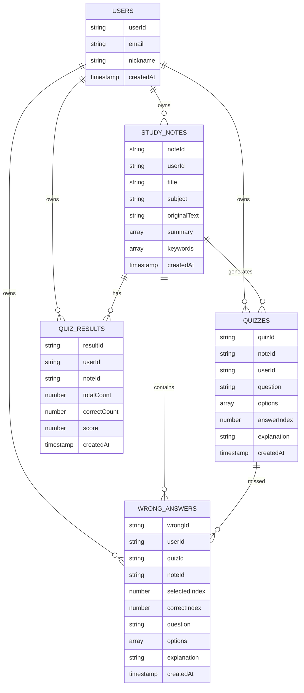

# 데이터 관계 설계서

## 1. 문서 목적

이 문서는 StudyMate의 Firestore 컬렉션 간 관계와 주요 조회 패턴을 정의한다.

## 2. 핵심 내용

StudyMate 데이터는 사용자 `userId`를 중심으로 연결된다. 학습 기록은 퀴즈, 결과, 오답의 기준 데이터가 된다.

## 3. 상세 설명

### 관계 정의

| 관계 | 설명 |
| --- | --- |
| users -> study_notes | 한 사용자는 여러 학습 기록을 가진다 |
| study_notes -> quizzes | 하나의 학습 기록에서 여러 퀴즈가 생성된다 |
| study_notes -> quiz_results | 하나의 학습 기록에 여러 풀이 결과가 저장될 수 있다 |
| quizzes -> wrong_answers | 틀린 퀴즈는 오답노트에 저장된다 |
| users -> wrong_answers | 사용자는 자신의 오답 목록을 조회한다 |

### 주요 조회 패턴

| 화면 | 조회 대상 | 조건 | 정렬 |
| --- | --- | --- | --- |
| HomeScreen | study_notes | userId == currentUserId | createdAt desc |
| SummaryResultScreen | study_notes | noteId == selectedNoteId | 없음 |
| QuizScreen | quizzes | noteId == selectedNoteId | createdAt asc |
| QuizResultScreen | quiz_results | resultId == selectedResultId | 없음 |
| WrongAnswerScreen | wrong_answers | userId == currentUserId | createdAt desc |
| MyPageScreen | study_notes, quiz_results | userId == currentUserId | 없음 |

### 데이터 중복 기준

오답노트는 `quizId`만 저장하지 않고 question, options, explanation을 함께 저장한다. AI가 생성한 원본 퀴즈 데이터가 삭제되거나 수정되어도 사용자가 당시 틀린 문제를 그대로 복습할 수 있어야 하기 때문이다.

## 4. 개발 시 참고사항

- Firestore는 관계형 DB가 아니므로 화면 조회에 필요한 필드는 문서에 중복 저장할 수 있다.
- 모든 조회는 로그인 사용자 `userId` 기준으로 제한한다.
- 복합 쿼리가 필요한 경우 Firestore 인덱스 생성이 필요할 수 있다.
- 사용자가 학습 기록을 삭제하면 연결된 퀴즈, 퀴즈 결과, 오답 문서도 함께 삭제한다.

## 5. 확인 체크리스트

- [ ] 사용자 기준 데이터 소유 관계가 명확한가?
- [ ] 학습 기록과 퀴즈의 연결 기준이 noteId로 통일되어 있는가?
- [ ] 오답노트가 quizId와 스냅샷 데이터를 모두 가지는가?
- [ ] 주요 화면별 조회 조건이 정의되어 있는가?
- [ ] Firestore 특성상 필요한 중복 저장이 설명되어 있는가?
